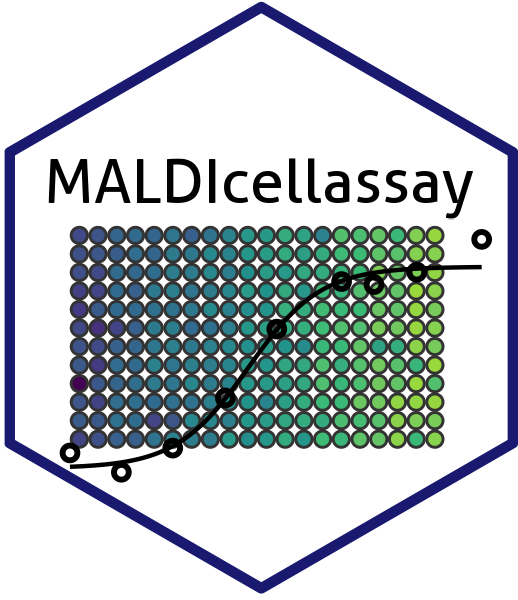

# MALDIcellassay 

<!-- badges: start -->

[](https://github.com/CeMOS-Mannheim/MALDIcellassay/actions/workflows/R-CMD-check.yaml) [](https://codecov.io/github/CeMOS-Mannheim/MALDIcellassay) [](https://CRAN.R-project.org/package=MALDIcellassay)

<!-- badges: end -->

Conduct automated cell-based assays using Matrix-Assisted Laser Desorption/Ionization (MALDI) methods for high-throughput screening of signals responsive to treatments. The package efficiently identifies high variance signals and fits dose-response curves to them. Quality metrics such as Z', V', log2-Fold-Change and the Curve response score (CRS) are provided for evaluating the potential of signals as biomarkers. The methodologies were introduced by [Weigt et al. (2018)](https://doi.org/10.1038/s41598-018-29677-z) and first release as the `MALDIcellassay`-package in [Unger et al. (2021)](https://doi.org/10.1038/s41596-021-00624-z).

## Main Functionality

The primary function in this package is `fitCurve()` which not only performs logistic regression and variance filtering but also handles all necessary preprocessing steps:

- Spectral alignment ("single-point recalibration")
- Normalization by an internal standard or known endogenous signal

All these functions can also be called independently.

This package makes heavy use of the `MALDIquant` framework.

## Installation

### From CRAN

You can install the released version of `MALDIcellassay` from CRAN with:

```r
install.packages("MALDIcellassay")
```

### From GitHub

To install the development version of the package, use devtools:
```r
# Install devtools if you haven't already
install.packages("devtools")

# Install MALDIcellassay from GitHub
devtools::install_github("CeMOS-Mannheim/MALDIcellassay")
```

## Example Usage

Here's a simple example to get you started with the `MALDIcellassay` package:
```r
library(MALDIcellassay)
library(MALDIquant)

# Load example data
data("Blank2022spec")

# Preprocess data
spec_prc <- MALDIquant::removeBaseline(Blank2022spec)
conc <- as.numeric(names(Blank2022spec))
names(spec_prc) <- conc

# Fit dose-response curve
res <- fitCurve(spec = spec_prc,
                SinglePointRecal = TRUE, 
                normMeth = "mz",
                varFilterMethod = "none",
                normMz = 760.585, 
                alignTol = 0, 
                normTol = 0.1, 
                verbose = FALSE)

# View the results
print(res)
```

For more detailed examples, check out the [vignette](https://cemos-mannheim.github.io/MALDIcellassay/articles/Example.html).
Also take a look at the [pkgdown-site](https://cemos-mannheim.github.io/MALDIcellassay/reference/index.html) for more details on specific functions.

## GUI

If you want to use `MALDIcellassay` interactively to explore your data, you might be interested in [M²ara](https://github.com/CeMOS-Mannheim/M2ara), which offers a Shiny-based interface. It is also available as a [docker container](https://hub.docker.com/repository/docker/thomasenzlein/m2ara) and as a stand-alone [Windows installer](https://github.com/CeMOS-Mannheim/m2ara/releases/latest/). You can find more details in the [preprint on M²ara](https://chemrxiv.org/engage/chemrxiv/article-details/663a1d0f418a5379b0aa286b).

## Contribution and Contact

We welcome contributions to `MALDIcellassay`! If you encounter any issues or have suggestions for improvement, please open an issue on GitHub or submit a pull request.

For any questions or further information, you can contact the maintainer:

    Name: Thomas Enzlein
    Email: t.enzlein@hs-mannheim.de

## Citation
If you use `MALDIcellassay` in your research, please cite:

Unger et al., 2021, "Label-free Cell Assays of Compound Uptake and Drug Action using MALDI-TOF Mass Spectrometry", Nature Protocols. DOI: https://doi.org/10.1038/s41596-021-00624-z.
